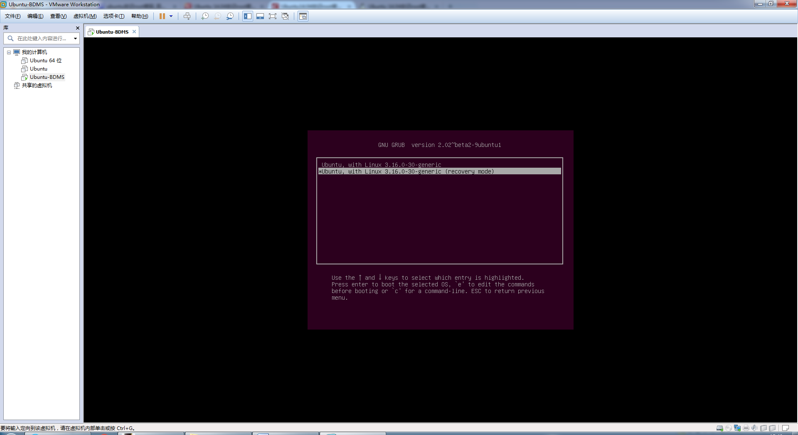

本文是用于找回虚拟机中的 Linux Root 密码。实体机应该也可以使用。:)

<!-- more -->

## 方法

### 1. 启动虚拟机

### 2. 在开启过程中一直按 `ESC` 进入如下界面

如果没有进入该界面而是直接开机了, 请重启并不断尝试按 `ESC` 直至出现该界面

进入该界面后选中第二项 `Advanced Options for Ubuntu` 按下 `Enter`

### 3. 进入如下界面

选中第二项, 也就是带有 `recovery mode` 的选项, 注意, 千万别回车! 按下 `e` 键进入编辑模式

### 4. 进入如下界面后, 注意红圈内容

将其删掉并修改为: `quiet splash rw init=/bin/bash`

### 5. 按 `ctrl+x` 或者 `F10` 执行

进入如下界面:

### 6. 输入代码: `passwd root`

按下 `Enter` 执行, 然后提示你输入新密码:

输入两次后修改成功, 然后重启就好了.

用 guest 用户登录, 在终端输入 `su -` 可切临时换到 root 账户.

至此 root 密码就是你设置的新密码, 完成.

## 题外话

另外  修改好密码后, guest 不能 sudo, 因为 guest 用户没有 sudo 权限, 需要作如下修改:

1. 以 guest 用户登录:
1. 打开终端  输入 `su -` 切换到 root 用户:
1. 输入: vim /etc/sudoers
1. 在 `%sudo ALL=(ALL:ALL) ALL` 的下一行添加 `guest  ALL=(ALL)  ALL`, 保存退出

这样 guest 就有 sudo 权限了.
