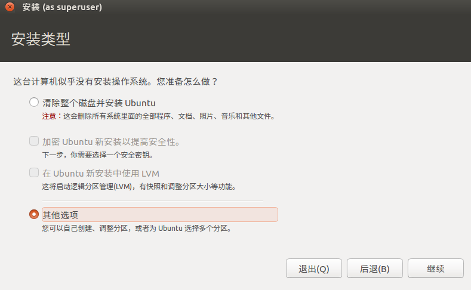
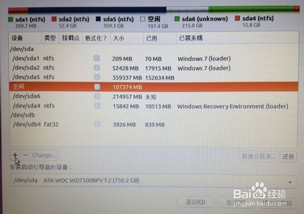
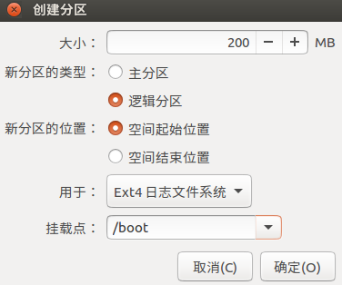
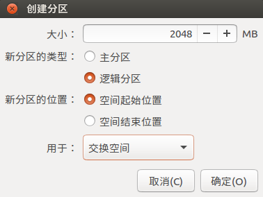
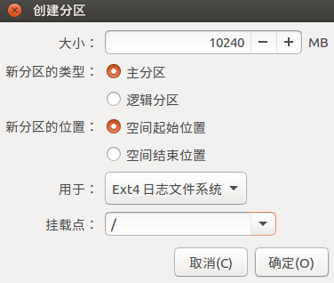
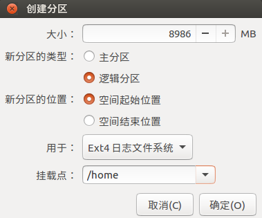
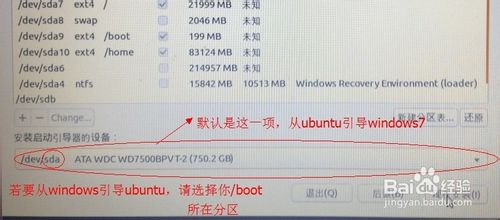
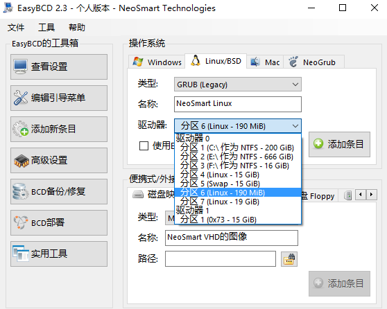
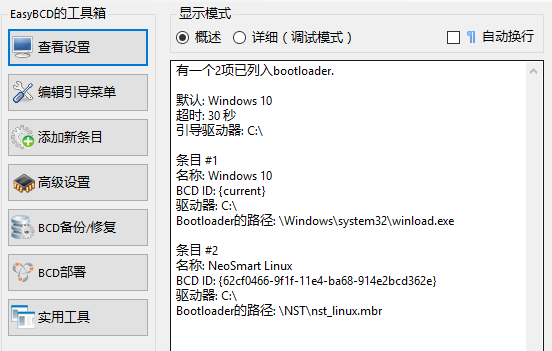
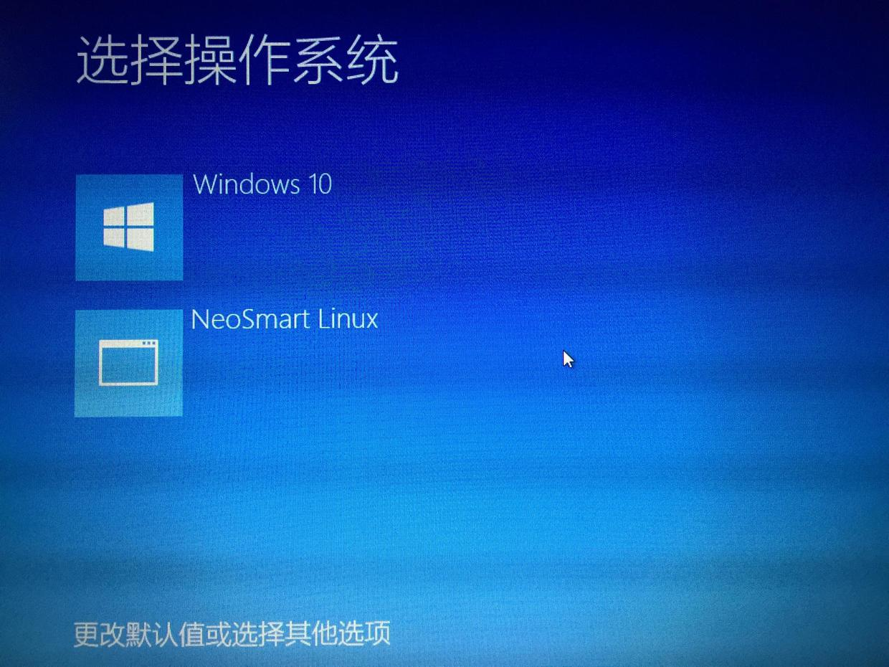

## 前置

EasyBCD 软件 + 镜像文件

## Step 1 划分空间

在 Win10 磁盘管理分出大约 20 G 的空间(可以通过 `压缩卷` 获得), 划好要给 Ubuntu 的分区后, 删除卷, `划分出来的部分显示为黑色`.

## Step 2 禁用安全启动

禁用主板 (BIOS or UEFI) 上的 Secure Boot: 设置 - 更新和安全 - 恢复 - 高级启动 - 疑难解答 - 高级选项 - UEFI 固件设置 - 重新启动

<!-- more -->

会进入类似 BIOS 的界面: Boot - Secure Boot - Disable

## Step 3 安装

将 Ubuntu 刻录到 U 盘上, 重启(设置 - 更新和安全 - 恢复 - 高级启动), 从 U 盘启动, 进入 Ubuntu 安装界面.

我们要手动分盘符, 所以, 出现下图时, 选择 "其它选项"

选中其中标有 "空闲" 的盘符, 这个盘符就是我们用于安装 Ubuntu 的 20 G 空间, 别动别的盘符, 点击下方的 "+"

接下来, 我们要进行四次分区, 每次都是从 "空闲" 中分出部分区域

* 第一次分区

选中 "空闲", 点 "+", 如下设置

大小: 200 MB

新分区的类型: 逻辑分区

新分区的位置: 空间起始位置

用于: EXT4 日志文件系统

挂载点: /boot (双系统引导时需要)

如下图所示

* 第二次分区

选中 "空闲", 点 "+", 如下设置

大小: 2048 MB

新分区的类型: 逻辑分区

新分区的位置: 空间起始位置

用于: 交换空间

挂载点: (不设置)

如下图所示

* 第三次分区

选中 "空闲", 点 "+", 如下设置

大小: 10240 MB

新分区的类型: 主分区

新分区的位置: 空间起始位置

用于: EXT4 日志文件系统

挂载点: "/"

如下图所示

* 第四次分区

选中 "空闲", 点 "+", 如下设置

大小: (剩余全部空间, 剩下显示多少, 就多少)

新分区的类型: 主分区

新分区的位置: 空间起始位置

用于: EXT4 日志文件系统

挂载点: /home

如下图所示

分区设置完毕后, 下方还有一项 "安装启动引导器的设备", 默认就如如下图所示那样 `sda`, 如果选择默认, 则是用 Ubuntu 的 grub 引导 Windows 和 Ubuntu, 卸载 Ubuntu 时可能会麻烦些.

如果想用 Windows 的引导来引导 Windows 和 Ubuntu(**推荐**), 请选择 `/boot 所在的盘符`, 然后在 Windows 下安装引导类的软件(如: EasyBCD, 见 Step 4), 才能启动 Ubuntu. 优点是不管怎么搞, 不会把 Windows 搞坏. 用 Windows 引导 Ubuntu 最大的好处就是, 当不再需要 Ubuntu 的时候, 直接在 Windows 磁盘管理中将其所有分区删除, 然后将 EasyBCD 中对应条目删除即可.

PS1: 然后点击 "现在安装", 如果出错不能继续, 说什么分区不对, 就把是主分区的新分区, 都重新设置为逻辑分区, 就可以了.

PS2: 设置好之后记住 `/boot` 所在的分区位置, 下面要用到.

## Step 4

进入 Win10 之后, 安装 EasyBCD, 然后新增一个启动项, 选择 Linux/Grub2, 启动位置选择刚才 `/boot` 所在的位置(如果没有给 `/boot` 分区, 则是 `/` 所在的位置), 保存退出, 重启就可以看到 Ubuntu 的入口了.

如下图所示

