## 1 引导基础篇: 什么是 UEFI, 什么是 GPT

本文目的是想用最简单直白的语言把内容写出来, 让每个人都能轻松读懂。当然, 如果你已经对这些内容有了很深的理解的话, 这篇文章除了浪费你的时间外恐怕是别无益处了, 建议去 UEFI 官方网站下载 UEFI 规范文档, 那里详细阐述了 UEFI、GPT 的每个技术细节。

<!-- more -->

其实 UEFI、GPT 都不是什么新鲜玩意了, 只不过因为预装 Win8 电脑指定采用了这一标准所以仿佛是在一夜之间关于 UEFI 启动 Windows 的文章就遍地开花了, 很多人大概也是头一次听说世上还有这玩意。既然 UEFI、GPT 是 "新" 技术, 那么就必然有较旧技术 (BIOS+MBR) 更先进、更 NB 的地方。到底 NB 在哪里呢？下面来简单比较一下:

### GPT 及其优势

GPT 和 MBR 是两种不同的分区方案。目前在 Windows 下广泛采用的磁盘分区方案仍然是 MBR 分区结构, 但不容怀疑 GPT 是今后的趋势。我们可将 MBR 磁盘分区结构用下图简单表示(Windows 下基本磁盘、4 个主分区):

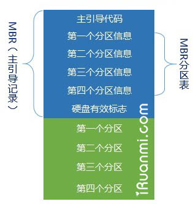MBR 分区结构

为了方便计算机访问硬盘, 把硬盘上的空间划分成许许多多的区块(英文叫 sectors, 即扇区), 然后给每个区块分配一个地址, 称为逻辑块地址(即 LBA)。

在 MBR 磁盘的第一个扇区内保存着启动代码和硬盘分区表。启动代码的作用是指引计算机从活动分区引导启动操作系统 (BIOS 下启动操作系统的方式); 分区表的作用是记录硬盘的分区信息。在 MBR 中, 分区表的大小是固定的, 一共可容纳 4 个主分区信息。在 MBR 分区表中逻辑块地址采用 32 位二进制数表示, 因此一共可表示 2^32(2 的 32 次方) 个逻辑块地址。如果一个扇区大小为 512 字节, 那么硬盘最大分区容量仅为 2TB。

GPT 磁盘分区结构可用下图简单表示(Windows 下基本磁盘):

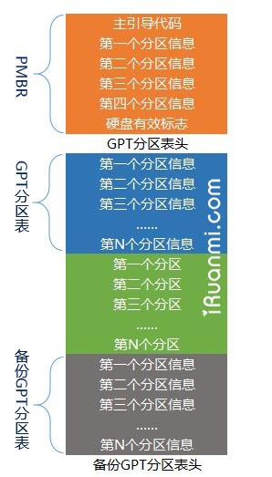GPT 分区结构

可以看到, 在 GTP 磁盘的第一个数据块中同样有一个与 MBR(主引导记录)类似的标记, 叫做 PMBR。PMBR 的作用是, 当使用不支持 GPT 的分区工具时, 整个硬盘将显示为一个受保护的分区, 以防止分区表及硬盘数据遭到破坏。UEFI 并不从 PMBR 中获取 GPT 磁盘的分区信息, 它有自己的分区表, 即 GPT 分区表。

GPT 的分区方案之所以比 MBR 更先进, 是因为在 GPT 分区表头中可自定义分区数量的最大值, 也就是说 GPT 分区表的大小不是固定的。在 Windows 中, 微软设定 GPT 磁盘最大分区数量为 128 个。另外, GPT 分区方案中逻辑块地址 (LBA) 采用 64 位二进制数表示, 可以计算一下 2^64 是一个多么庞大的数据, 以我们的需求来讲完全有理由认为这个大小约等于无限。除此之外, GPT 分区方案在硬盘的末端还有一个备份分区表, 保证了分区信息不容易丢失。

### Windows 操作系统对 GPT 磁盘的支持

因为 BIOS 无法识别 GPT 分区, 所以 BIOS 下 GPT 磁盘不能用于启动操作系统, 在操作系统提供支持的情况下可用于数据存储。

UEFI 可同时识别 MBR 分区和 GPT 分区, 因此 UEFI 下, MBR 磁盘和 GPT 磁盘都可用于启动操作系统和数据存储。不过微软限制, UEFI 下使用 Windows 安装程序安装操作系统是只能将系统安装在 GPT 磁盘中。

下表列出了 Windows 各版本操作系统对 GPT 磁盘的支持程度:

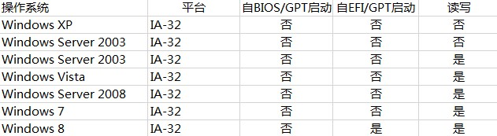32 位 Windows 对 GPT 分区支持情况

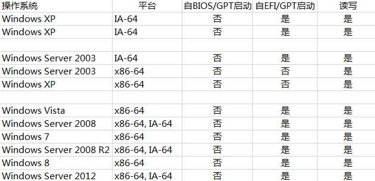64 位 Windows 对 GPT 分区支持情况

### UEFI 及其优势

UEFI 是 BIOS 的一种升级替代方案。关于 BIOS 和 UEFI 二者的比较, 网络上已经有很多相关的文章, 这里不再赘述, 仅从系统启动原理方面来做比较。UEFI 之所以比 BIOS 强大, 是因为 UEFI 本身已经相当于一个微型操作系统, 其带来的便利之处在于:

** 首先, **UEFI 已具备文件系统的支持, 它能够直接读取 FAT 分区中的文件;

> 什么是文件系统？简单说, 文件系统是操作系统组织管理文件的一种方法, 直白点说就是把硬盘上的数据以文件的形式呈现给用户。Fat32、NTFS 都是常见的文件系统类型。

**其次,** 可开发出直接在 UEFI 下运行的应用程序, 这类程序文件通常以 efi 结尾。

既然 UEFI 可以直接识别 FAT 分区中的文件, 又有可直接在其中运行的应用程序。那么完全可以 **将 Windows 安装程序做成 efi 类型应用程序, 然后把它放到任意 fat 分区中直接运行即可**, 如此一来安装 Windows 操作系统这件过去看上去稍微有点复杂的事情突然就变非常简单了, 就像在 Windows 下打开 QQ 一样简单。而事实上, 也就是这么一回事。

要知道, 这些都是 BIOS 做不到的。因为 BIOS 下启动操作系统之前, 必须从硬盘上指定扇区读取系统启动代码 (包含在主引导记录中), 然后从活动分区中引导启动操作系统。对扇区的操作远比不上对分区中文件的操作更直观更简单, 所以在 BIOS 下引导安装 Windows 操作系统, 我们不得不使用一些工具对设备进行配置以达到启动要求。而在 UEFI 下, 这些统统都不需要, **不再需要主引导记录, 不再需要活动分区, 不需要任何工具, 只要复制安装文件到一个 FAT32(主) 分区 / U 盘中, 然后从这个分区 / U 盘启动, 安装 Windows 就是这么简单**。后面会有专门的文章来详细介绍 UEFI 下安装 Windows7、8 的方法。

## 2 引导实践篇(一): 切换到 UEFI 启动, 准备安装介质

如果只单纯比较 UEFI 引导和 BIOS 引导, 那么毫无疑问 UEFI 引导要简单很多。不过现在的主板大都是同时兼容 BIOS 和 UEFI 引导方式, 所以在实际操作前还需要确认一些东西。详见下文。

### 1、我的电脑支不支持 UEFI 启动？

要通过 UEFI 方式启动 Windows7/8, 电脑需要支持 UEFI 启动。预装 Win8 的电脑都支持 UEFI 启动。近两年的主板很多也都支持 UEFI 启动。开机出现品牌标识按 F2(或者 DEL、ESC 等按键, 不通品牌按键不通)进入 BIOS/UEFI 设置, 在 Boot 项或类似项中查看有无 EFI/UEFI 相关选项, 如果有, 那么说明电脑支持 UEFI 启动。下图是联想 Y480UEFI 选项:

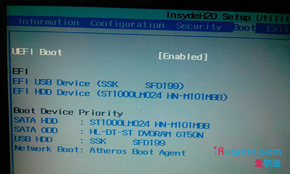联想 Y480 UEFI 引导选项

### 2、想要 UEFI 启动, 我该选择安装什么操作系统？

目前几乎所有支持 UEFI 的个人电脑都是 64 位 UEFI 系统, 仅支持 64 位 Vista、64 位 Win7 以及 64 位 Win8/8.1。所以你只能从这几个操作系统中选择。切记, 只有原版镜像支持光盘 UEFI 启动, 一定要选择下载微软原版系统！**建议选择的版本:** 不管是 Win7、Win8 或 Win8.1, 都建议选择专业版; 激活都选择[KMS 激活方式](http://www.iruanmi.com/kmspico/)。

**提示:** 已经下载了 Win7 旗舰版镜像的朋友, 如采用 U 盘安装或从硬盘引导安装(后面会讲到), 在准备好安装介质后只需要删除 sources 文件夹下面的 ei.cfg 文件即可选择安装除企业版之外任意版本, 包括专业版。

### 3、预装 Win8 的电脑想要安装 64 位 Win7、Vista 需关闭安全启动, 并开启 CSM

具体选项:
① 某些预装 Win8 的电脑有名为 OS Optimized Defaults 的设置选项, 需要将这个选项设置为 Disabled。
② 找到类似 "Boot mode" 或者 "UEFI/Legacy Boot" 设置项, 将其设置为 "UEFI" 或类似选项。
③ 如果能找到 "Lunch CSM" 或类似选项, 将其设为 "Enabled", 即开启状态。
④ 找到 "Secure Boot" 或类似选项, 将其设为 "Disabled", 即关闭状态。不关闭安全启动, 无法安装 Win8 之外的操作系统。
详细教程: 《[预装 64 位 Win8/8.1 电脑安装 64 位 Win7 详细过程(单 / 双系统)](http://www.iruanmi.com/install-64bit-windows-7-on-a-pre-installed-win8-pc/)》

### 4、(非安装双系统跳过此步)为将要安装的操作系统开辟新的分区

如果想要在现有系统基础上再安装一个操作系统组成双系统, 首先你现有的系统必须为 UEFI+GPT 引导(例如, 预装 Win8 系统), 否则只能在安装过程中删除硬盘所有数据自动完成转换。
确定是否为 GPT 分区: 打开磁盘管理, 找到硬盘 0, 然后右键点击。如果有灰色选项 "转换成 MBR 磁盘" 则说明硬盘为 GPT 分区, 如下图①所示, 并且系统一定为 UEFI 引导。
开辟新分区的方法: 打开磁盘管理, 在剩余空间较大的分区上右键点击, 选择 "压缩", 如下图 2 所示。然后输入合适的大小压缩即可(推荐不小于 50G)。

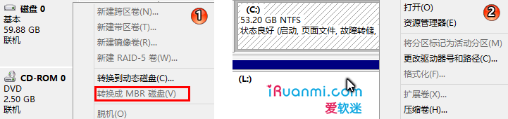查看硬盘分区结构 & 压缩分区空间

### 5、准备安装介质

有三种选择:

一、可以将微软原版 64 为 Win7 镜像、64 位 Win8 镜像直接刻入光盘, 从光盘启动安装。
二、可以准备一个容量不小于 4G 的 U 盘, 格式化为 FAT32, 然后复制 64 为 Win7 镜像或 64 位 Win8 镜像中的所有文件到 U 盘根目录, 文件结构如下图①所示。如果安装的是 64 位 Win7, 还需要下载 bootx64.efi 文件([点击下载](http://pan.baidu.com/s/1qWDH6Ny)), 然后在 U 盘中 efi 文件夹下新建名为 boot 的文件夹, 把 bootx64.efi 文件放到里边。如下图②所示。
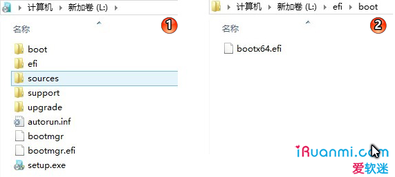

启动介质中文件结构

三、也可以在电脑硬盘或者移动硬盘 (都必须为 GPT 分区) 任意位置压缩出一个分区(大小在 4G~30G 之间), 格式化为 FAT32, 然后参考上一条复制文件即可。

**特别提示:** 如果下载的是 Win7 旗舰版, 想要安装专业版, 只需在准备好安装介质后删掉 sources 目录中的 ei.cfg 文件即可选择安装除企业版之外的任意版本, 包括专业版。

OK, 要准备的就这些。安装过程请参考《[UEFI+GPT 引导实践篇(二): UEFI 引导安装 64 位 Win7/Win8](http://www.iruanmi.com/install-win7-or-win8-on-uefi-platform/)》。

## 3 UEFI+GPT 引导实践篇(二): UEFI 引导安装 64 位 Win7/Win8

下文是在联想 Y480 笔记本上以 UEFI 方式启动安装 Windows8 的全过程, 安装 Windows7 过程基本相同。注意, 如果你的电脑硬盘是 MBR 分区结构, 安装过程中将要删除硬盘上所有数据, 请安装前备份硬盘上的所有个人文件。

** 准备容量不小于 4G 的 U 盘一个, 格式化为 FAT32。然后复制 64 位 Win8 镜像中的所有文件到 U 盘根目录。** 注: 如果安装的是 64 位 Win7, 还需要下载 bootx64.efi 文件([点击下载](http://pan.baidu.com/s/1qWDH6Ny)), 然后在 U 盘中 efi 文件夹下新建名为 boot 的文件夹, 把 bootx64.efi 文件放到里边。预装 Win8/8.1 电脑安装 Win7 还需要更改几个 BIOS 设置, 相关准备工作请参考《[UEFI+GPT 引导准备篇: 切换到 UEFI 启动, 准备安装介质](http://www.iruanmi.com/get-ready-for-installing/)》或参考专门针对此情况的完整教程《[预装 64 位 Win8/8.1 电脑安装 64 位 Win7 详细过程(单 / 双系统)](http://www.iruanmi.com/install-64bit-windows-7-on-a-pre-installed-win8-pc/)》。

重启电脑, 出现联想标识时按 F2 打开 BIOS 设置界面, 切换到 "boot" 设置界面将 UEFI Boot 设置项设置为 "Enable", 这样就开启了 UEFI。按 F10 键, 保存设置。

重启, 在出现联想标识时按 F12 键, 此时出现启动设备选择界面, 我们可以看到这里有两个 USB 设备。图中被选中的名称前面可以看到 "EFI" 字样, 这就表示该设备是可以 EFI 引导的设备。我们就需要选择这一项。

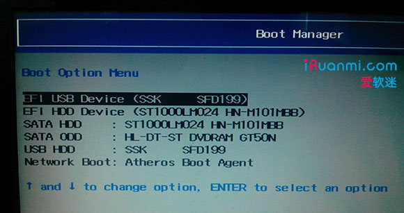

选中图中的选项后, 电脑会开始加载 Windows 预安装环境文件。(注: 小编实际操作时安装的是 64 位 Win7, 但是手机拍下来的图很不清晰, 所以就在虚拟机中在 UEFI 模式下安装了 64 位 Win8, 二者无区别)

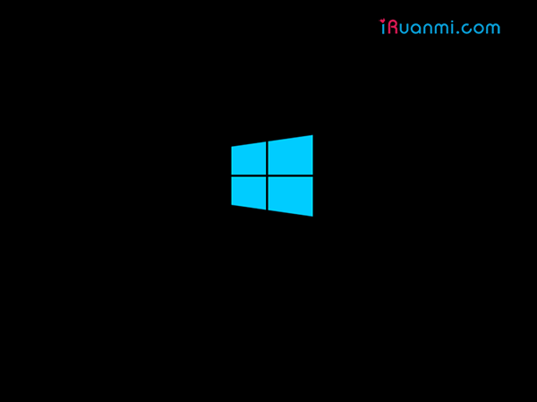

稍等出现下面的界面, 默认即可。

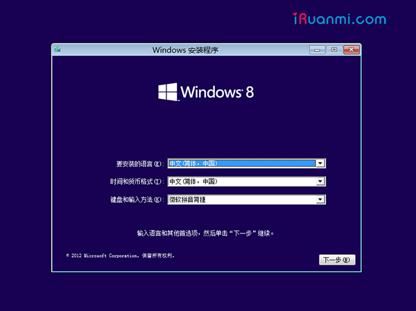

上图: 点下一步

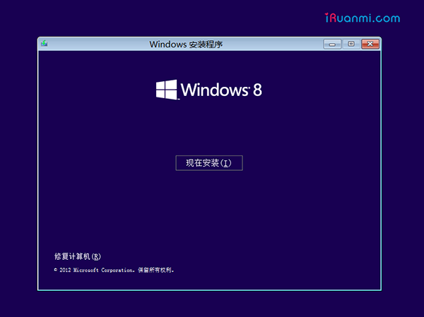

上图: 点 "现在安装"

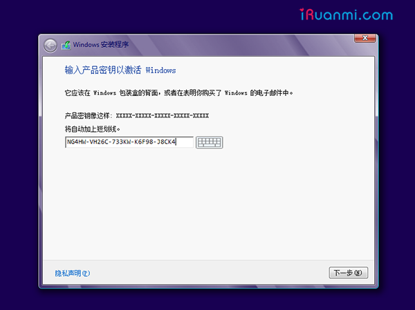

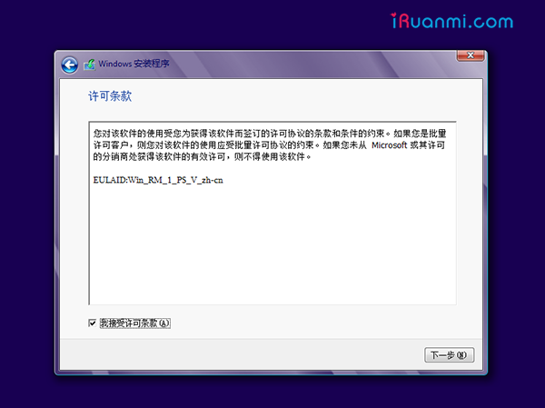

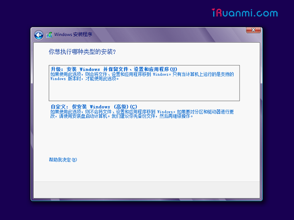

上图: 这里选择 "自定义", 进入分区选择界面。如果你的电脑硬盘已经为 GPT 分区结构, 那么直接选择目标分区, 将其格式化, 然后选中点下一步即可。下面是硬盘位 MBR 分区结构的情况:

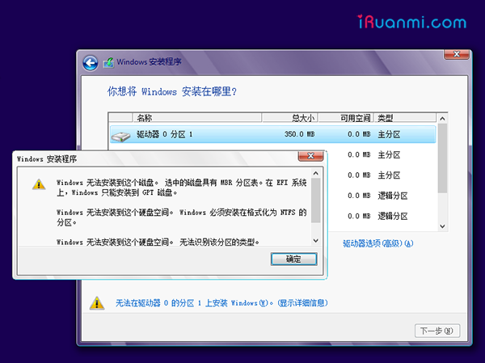

上图: 如果你的电脑硬盘为 MBR 分区结构, 那么会看到 "无法在驱动器 X 的分区 x 上安装 Windows" 的提示, 这时候需要点击 "驱动器选项(高级)", 然后删除硬盘上所有的分区使得整个硬盘变成一块未分配空间。提示: 在这一步你也可以按 Shift+F10 或者 Shift+Fn+F10 调出命令提示符窗口, 然后借助 diskpart 工具将硬盘转换为 GPT 分区。命令详见《[Diskpart 工具应用两则: MBR/GPT 分区转换 & 基本 / 动态磁盘转换](http://www.iruanmi.com/convert-gpt-to-mbr-or-convert-mbr-to-gpt-use-diskpart-tool/)》。

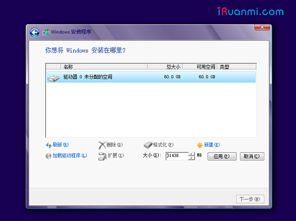

上图: 整个硬盘已成为一块未分配空间。点击 "新建", 输入想要为系统安装分区分配的空间大小(推荐不小于 50G), 点击 "应用"。

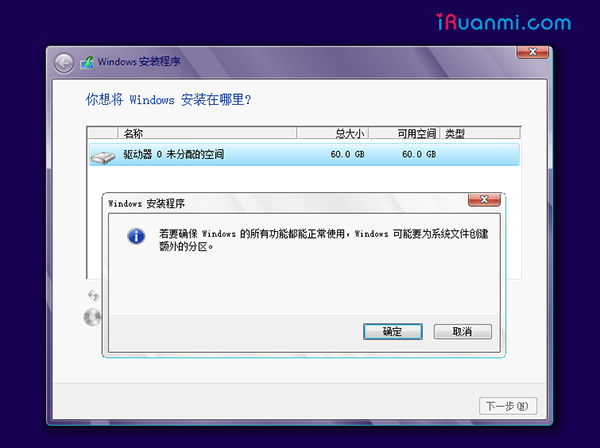

上图: 此时提示将创建额外的分区, 点击 "确定"。之后安装程序会自动将硬盘转换为 GPT 分区。创建完成后你将看到四个创建好的分区, 如下图所示。关于这些分区的作用详见《[用于引导 Windows 的 GPT 磁盘 (预装 Win8 电脑) 各分区作用详解](http://www.iruanmi.com/win8-oem-devices-disk-partition-analysis/)》

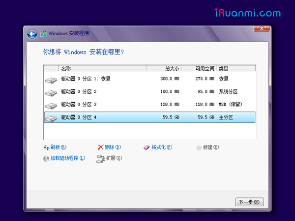

选择第一个主分区, 然后点 "下一步" 就开始安装了。之后根据提示操作即可完成系统安装。

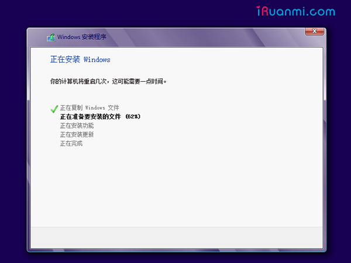

### 后记

实际上只有遵循 UEFI 规范的主板才能按照 efi/boot/bootx64.efi 路径启动 Windows 安装程序, 大多数主板都是遵循这一规范的。如果不遵循这一规范, 那么你需要手动选择从该文件启动, 或者需要在 UEFI Shell 中以命令的方式启动 bootx64.efi。关于这些后面会有文章来详解。另外关于预装 Win8 电脑改装 Win7 或者安装 Win8+Win7 双系统都会有专门教程。

## 参考

整理自:
http://www.iruanmi.com/what-is-gpt-and-what-is-uefi/
http://www.iruanmi.com/get-ready-for-installing/
http://www.iruanmi.com/install-win7-or-win8-on-uefi-platform/
