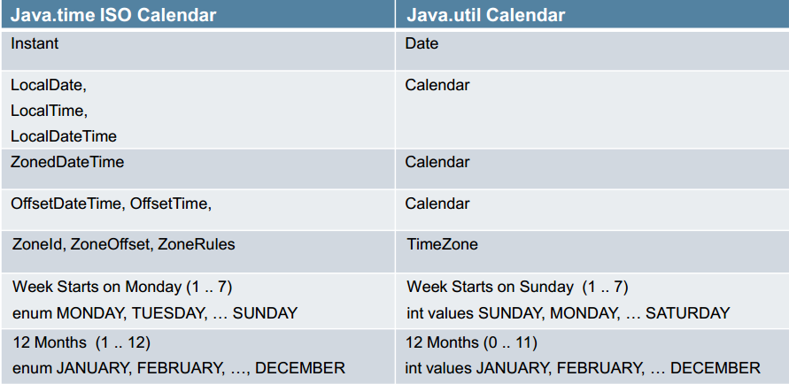

转自: https://my.oschina.net/benhaile/blog/193956

摘要: JSR310 已在 java8 中实现了, 对于恶心的 java.util.Date 和 Calendar, 终于可以休息了吧。。。

这次给大家讲下 java8 时间与日期 API。

众所周知, 日期是商业逻辑计算一个关键的部分, 任何企业应用程序都需要处理时间问题。应用程序需要知道当前的时间点和下一个时间点, 有时它们还必须计算这两个时间点之间的路径。但 java 之前的日期做法太令人恶心了, 我们先来吐槽一下

<!-- more -->

## 吐槽 java.util.Date 跟 Calendar

Tiago Fernandez 做过一次投票, 选举最烂的 JAVA API, 排第一的 EJB2.X, 第二的就是日期 API。

### 槽点一

最开始的时候, Date 既要承载日期信息, 又要做日期之间的转换, 还要做不同日期格式的显示, 职责较繁杂(不懂单一职责, 你妈妈知道吗？纯属恶搞~ 哈哈)

后来从 JDK 1.1 开始, 这三项职责分开了:

* 使用 Calendar 类实现日期和时间字段之间转换;
* 使用 DateFormat 类来格式化和分析日期字符串;
* 而 Date 只用来承载日期和时间信息。

原有 Date 中的相应方法已废弃。不过, 无论是 Date, 还是 Calendar, 都用着太不方便了, 这是 API 没有设计好的地方。

### 槽点二

坑爹的 year 和 month

```java
Date date = new Date(2012,1,1);
System.out.println(date);
// 输出 Thu Feb 01 00:00:00 CST 3912
```

观察输出结果, year 是 2012+1900, 而 month, 月份参数我不是给了 1 吗？怎么输出二月 (Feb) 了？

应该曾有人告诉你, 如果你要设置日期, 应该使用 java.util.Calendar, 像这样...

```java
Calendar calendar = Calendar.getInstance();
calendar.set(2013, 8, 2);
```

这样写又不对了, calendar 的 month 也是从 0 开始的, 表达 8 月份应该用 7 这个数字, 要么就干脆用枚举

```java
calendar.set(2013, Calendar.AUGUST, 2);
```

注意上面的代码, Calendar 年份的传值不需要减去 1900(当然月份的定义和 Date 还是一样), 这种不一致真是让人抓狂！

有些人可能知道, Calendar 相关的 API 是 IBM 捐出去的, 所以才导致不一致。

### 槽点三

java.util.Date 与 java.util.Calendar 中的所有属性都是可变的

下面的代码, 计算两个日期之间的天数....

```java
public static void main(String[] args) {
    Calendar birth = Calendar.getInstance();
    birth.set(1975, Calendar.MAY, 26);
    Calendar now = Calendar.getInstance();
    System.out.println(daysBetween(birth, now));
    System.out.println(daysBetween(birth, now)); // 显示 0？
 }

public static long daysBetween(Calendar begin, Calendar end) {
    long daysBetween = 0;
    while(begin.before(end)) {
        begin.add(Calendar.DAY_OF_MONTH, 1);
        daysBetween++;
    }
    return daysBetween;
}
```

daysBetween 有点问题, 如果连续计算两个 Date 实例的话, 第二次会取得 0, 因为 Calendar 状态是可变的, 考虑到重复计算的场合, 最好复制一个新的 Calendar

```java
public static long daysBetween(Calendar begin, Calendar end) {
    Calendar calendar = (Calendar) begin.clone(); // 复制
    long daysBetween = 0;
    while(calendar.before(end)) {
        calendar.add(Calendar.DAY_OF_MONTH, 1);
        daysBetween++;
    }
    return daysBetween;
}
```

## JSR310

以上种种, 导致目前有些第三方的 java 日期库诞生, 比如广泛使用的 JODA-TIME, 还有 Date4j 等, 虽然第三方库已经足够强大, 好用, 但还是有兼容问题的, 比如标准的 JSF 日期转换器与 joda-time API 就不兼容, 你需要编写自己的转换器, 所以标准的 API 还是必须的, 于是就有了 JSR310。

JSR 310 实际上有两个日期概念。第一个是 Instant, 它大致对应于 java.util.Date 类, 因为它代表了一个确定的时间点, 即相对于标准 Java 纪元 (1970 年 1 月 1 日) 的偏移量; 但与 java.util.Date 类不同的是其精确到了纳秒级别。

第二个对应于人类自身的观念, 比如 LocalDate 和 LocalTime。他们代表了一般的时区概念, 要么是日期(不包含时间), 要么是时间(不包含日期), 类似于 java.sql 的表示方式。此外, 还有一个 MonthDay, 它可以存储某人的生日(不包含年份)。每个类都在内部存储正确的数据而不是像 java.util.Date 那样利用午夜 12 点来区分日期, 利用 1970-01-01 来表示时间。

目前 Java8 已经实现了 JSR310 的全部内容。新增了 java.time 包定义的类表示了日期 - 时间概念的规则, 包括 instants, durations, dates, times, time-zones and periods。这些都是基于 ISO 日历系统, 它又是遵循 Gregorian 规则的。最重要的一点是值不可变, 且线程安全, 通过下面一张图, 我们快速看下 [java.time](http://download.java.net/jdk8/docs/api/index.html?java/time/package-summary.html) 包下的一些主要的类的值的格式, 方便理解。


### 方法概览

该包的 API 提供了大量相关的方法, 这些方法一般有一致的方法前缀:

* of: 静态工厂方法。
* parse: 静态工厂方法, 关注于解析。
* get: 获取某些东西的值。
* is: 检查某些东西的是否是 true。
* with: 不可变的 setter 等价物。
* plus: 加一些量到某个对象。
* minus: 从某个对象减去一些量。
* to: 转换到另一个类型。
* at: 把这个对象与另一个对象组合起来, 例如: date.atTime(time)。

### 与旧的 API 对应关系



### 简单使用 java.time 的 API

参考 http://jinnianshilongnian.iteye.com/blog/1994164, 被我揉在一起, 可读性很差, 相应的代码都有注释了, 我就不过多解释了。

```java
public class TimeIntroduction {
    public static void testClock() throws InterruptedException {
        // 时钟提供给我们用于访问某个特定 时区的 瞬时时间、日期 和 时间的。
        Clock c1 = Clock.systemUTC(); // 系统默认 UTC 时钟(当前瞬时时间 System.currentTimeMillis())
        System.out.println(c1.millis()); // 每次调用将返回当前瞬时时间(UTC)
        Clock c2 = Clock.systemDefaultZone(); // 系统默认时区时钟(当前瞬时时间)
        Clock c31 = Clock.system(ZoneId.of("Europe/Paris")); // 巴黎时区
        System.out.println(c31.millis()); // 每次调用将返回当前瞬时时间(UTC)
        Clock c32 = Clock.system(ZoneId.of("Asia/Shanghai"));// 上海时区
        System.out.println(c32.millis());// 每次调用将返回当前瞬时时间(UTC)
        Clock c4 = Clock.fixed(Instant.now(), ZoneId.of("Asia/Shanghai"));// 固定上海时区时钟
        System.out.println(c4.millis());
        Thread.sleep(1000);
        System.out.println(c4.millis()); // 不变 即时钟时钟在那一个点不动
        Clock c5 = Clock.offset(c1, Duration.ofSeconds(2)); // 相对于系统默认时钟两秒的时钟
        System.out.println(c1.millis());
        System.out.println(c5.millis());
    }
    public static void testInstant() {
        // 瞬时时间 相当于以前的 System.currentTimeMillis()
        Instant instant1 = Instant.now();
        System.out.println(instant1.getEpochSecond());// 精确到秒 得到相对于 1970-01-01 00:00:00 UTC 的一个时间
        System.out.println(instant1.toEpochMilli()); // 精确到毫秒
        Clock clock1 = Clock.systemUTC(); // 获取系统 UTC 默认时钟
        Instant instant2 = Instant.now(clock1);// 得到时钟的瞬时时间
        System.out.println(instant2.toEpochMilli());
        Clock clock2 = Clock.fixed(instant1, ZoneId.systemDefault()); // 固定瞬时时间时钟
        Instant instant3 = Instant.now(clock2);// 得到时钟的瞬时时间
        System.out.println(instant3.toEpochMilli());//equals instant1
    }
    public static void testLocalDateTime() {
        // 使用默认时区时钟瞬时时间创建 Clock.systemDefaultZone() --> 即相对于 ZoneId.systemDefault()默认时区
        LocalDateTime now = LocalDateTime.now();
        System.out.println(now);
        // 自定义时区
        LocalDateTime now2 = LocalDateTime.now(ZoneId.of("Europe/Paris"));
        System.out.println(now2);// 会以相应的时区显示日期
        // 自定义时钟
        Clock clock = Clock.system(ZoneId.of("Asia/Dhaka"));
        LocalDateTime now3 = LocalDateTime.now(clock);
        System.out.println(now3);// 会以相应的时区显示日期
        // 不需要写什么相对时间 如 java.util.Date 年是相对于 1900 月是从 0 开始
        //2013-12-31 23:59
        LocalDateTime d1 = LocalDateTime.of(2013, 12, 31, 23, 59);
        // 年月日 时分秒 纳秒
        LocalDateTime d2 = LocalDateTime.of(2013, 12, 31, 23, 59, 59, 11);
        // 使用瞬时时间 + 时区
        Instant instant = Instant.now();
        LocalDateTime d3 = LocalDateTime.ofInstant(Instant.now(), ZoneId.systemDefault());
        System.out.println(d3);
        // 解析 String--->LocalDateTime
        LocalDateTime d4 = LocalDateTime.parse("2013-12-31T23:59");
        System.out.println(d4);
        LocalDateTime d5 = LocalDateTime.parse("2013-12-31T23:59:59.999");// 999 毫秒 等价于 999000000 纳秒
        System.out.println(d5);
        // 使用 DateTimeFormatter API 解析 和 格式化
        DateTimeFormatter formatter = DateTimeFormatter.ofPattern("yyyy/MM/dd HH:mm:ss");
        LocalDateTime d6 = LocalDateTime.parse("2013/12/31 23:59:59", formatter);
        System.out.println(formatter.format(d6));
        // 时间获取
        System.out.println(d6.getYear());
        System.out.println(d6.getMonth());
        System.out.println(d6.getDayOfYear());
        System.out.println(d6.getDayOfMonth());
        System.out.println(d6.getDayOfWeek());
        System.out.println(d6.getHour());
        System.out.println(d6.getMinute());
        System.out.println(d6.getSecond());
        System.out.println(d6.getNano());
        // 时间增减
        LocalDateTime d7 = d6.minusDays(1);
        LocalDateTime d8 = d7.plus(1, IsoFields.QUARTER_YEARS);
        // LocalDate 即年月日 无时分秒
        // LocalTime 即时分秒 无年月日
        // API 和 LocalDateTime 类似就不演示了
    }
    public static void testZonedDateTime() {
        // 即带有时区的 date-time 存储纳秒、时区和时差(避免与本地 date-time 歧义)。
        // API 和 LocalDateTime 类似, 只是多了时差(如 2013-12-20T10:35:50.711+08:00[Asia/Shanghai])
        ZonedDateTime now = ZonedDateTime.now();
        System.out.println(now);
        ZonedDateTime now2 = ZonedDateTime.now(ZoneId.of("Europe/Paris"));
        System.out.println(now2);
        // 其他的用法也是类似的 就不介绍了
        ZonedDateTime z1 = ZonedDateTime.parse("2013-12-31T23:59:59Z[Europe/Paris]");
        System.out.println(z1);
    }
    public static void testDuration() {
        // 表示两个瞬时时间的时间段
        Duration d1 = Duration.between(Instant.ofEpochMilli(System.currentTimeMillis() - 12323123), Instant.now());
        // 得到相应的时差
        System.out.println(d1.toDays());
        System.out.println(d1.toHours());
        System.out.println(d1.toMinutes());
        System.out.println(d1.toMillis());
        System.out.println(d1.toNanos());
        // 1 天时差 类似的还有如 ofHours()
        Duration d2 = Duration.ofDays(1);
        System.out.println(d2.toDays());
    }
    public static void testChronology() {
        // 提供对 java.util.Calendar 的替换, 提供对年历系统的支持
        Chronology c = HijrahChronology.INSTANCE;
        ChronoLocalDateTime d = c.localDateTime(LocalDateTime.now());
        System.out.println(d);
    }
    /**
     * 新旧日期转换
     */
    public static void testNewOldDateConversion(){
        Instant instant=new Date().toInstant();
        Date date=Date.from(instant);
        System.out.println(instant);
        System.out.println(date);
    }
    public static void main(String[] args) throws InterruptedException {
        testClock();
        testInstant();
        testLocalDateTime();
        testZonedDateTime();
        testDuration();
        testChronology();
        testNewOldDateConversion();
    }
}
```

```java
// 取本月第 1 天:
LocalDate firstDayOfThisMonth = today.with(TemporalAdjusters.firstDayOfMonth()); // 2014-12-01
// 取本月第 2 天:
LocalDate secondDayOfThisMonth = today.withDayOfMonth(2); // 2014-12-02
// 取本月最后一天, 再也不用计算是 28, 29, 30 还是 31:
LocalDate lastDayOfThisMonth = today.with(TemporalAdjusters.lastDayOfMonth()); // 2014-12-31
// 取下一天:
LocalDate firstDayOf2015 = lastDayOfThisMonth.plusDays(1); // 变成了 2015-01-01
// 取 2015 年 1 月第一个周一, 这个计算用 Calendar 要死掉很多脑细胞:
LocalDate firstMondayOf2015 = LocalDate.parse("2015-01-01").with(TemporalAdjusters.firstInMonth(DayOfWeek.MONDAY)); // 2015-01-05
```

## 与 Joda-Time 的区别

其实 JSR310 的规范领导者 Stephen Colebourne, 同时也是 Joda-Time 的创建者, JSR310 是在 Joda-Time 的基础上建立的, 参考了绝大部分的 API, 但并不是说 JSR310=JODA-Time, 下面几个比较明显的区别是

1. 最明显的变化就是包名(从 org.joda.time 以及 java.time)
1. JSR310 不接受 NULL 值, Joda-Time 视 NULL 值为 0
1. JSR310 的计算机相关的时间 (Instant) 和与人类相关的时间 (DateTime) 之间的差别变得更明显
1. JSR310 所有抛出的异常都是 DateTimeException 的子类。虽然 DateTimeException 是一个 RuntimeException

## 总结

对比旧的日期 API

| Java.time | java.util.Calendar 以及 Date |
| --------- | --------------------------- |
| 流畅的 API | 不流畅的 API                 |
| 实例不可变  | 实例可变                     |
| 线程安全   | 非线程安全                    |

日期与时间处理 API, 在各种语言中, 可能都只是个不起眼的 API, 如果你没有较复杂的时间处理需求, 可能只是利用日期与时间处理 API 取得系统时间, 简单做些显示罢了, 然而如果认真看待日期与时间, 其复杂程度可能会远超过你的想象, 天文、地理、历史、政治、文化等因素, 都会影响到你对时间的处理。所以在处理时间上, 最好选用 JSR310(如果你用 java8 的话就实现 310 了), 或者 Joda-Time。

不止是 java 面临时间处理的尴尬, 其他语言同样也遇到过类似的问题, 比如

Arrow: Python 中更好的日期与时间处理库

Moment.js: JavaScript 中的日期库

Noda-Time: .NET 阵营的 Joda-Time 的复制