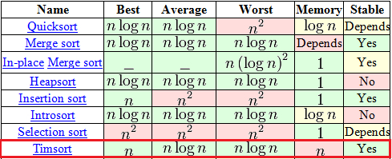

参考:

* http://www.freebuf.com/vuls/62129.html
* http://blog.csdn.net/yangzhongblog/article/details/8184707

## 1

Timsort 是结合了合并排序 (merge sort) 和插入排序 (insertion sort) 而得出的排序算法, Tim Peters 在 2002 年 (相比其他排序算法算是后起之秀) 设计了该算法并在 Python 中使用(TimSort 是 Python 中 list.sort 的默认实现), 现在 Java SE7 和 Android 也采用 Timsort 算法对数组排序。

<!-- more -->

我们评价一个排序算法的好坏要从许多方面衡量, 如下面这张图, 它在现实中有很好的效率。快排虽然平均时间复杂度非常好, 但是在最优、最坏时间复杂度以及算法的稳定性上来说都不如 Timsort。

算法比较
