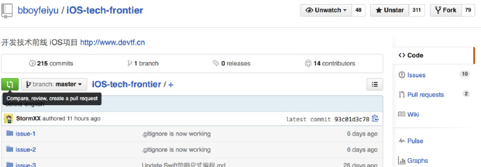
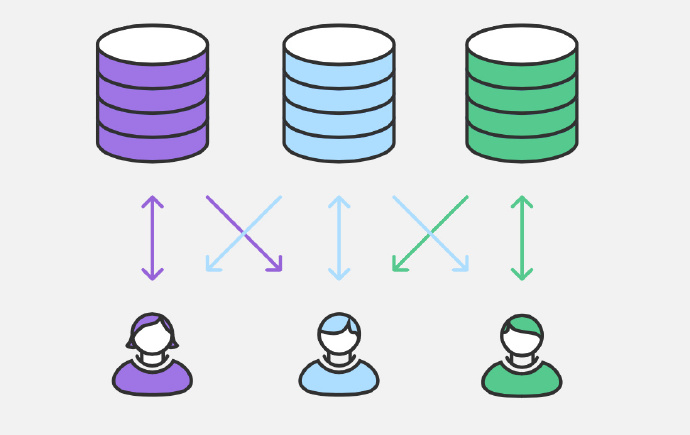
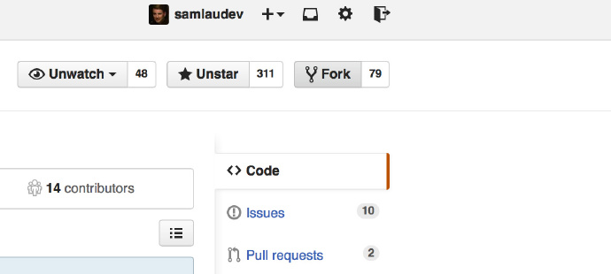

这篇文章是针对 **Git Flow & Git 命令** 的 **总结**。

我花费了很大精力才完成的！

<!-- more -->

## 1. 基本概念

### 1.1 Git V.S. SVN

SVN 是 **集中化** 的版本控制系统, 虽然能够令多个团队成员一起协作开发, 但有时如果中央服务器宕机的话, 谁也无法在宕机期间提交更新和协同开发。甚至有时, 中央服务器磁盘故障, 恰巧又没有做备份或备份没及时, 那就可能有丢失数据的风险。

Git 是 **分布式** 的版本控制系统, 客户端不只是提取最新版本的快照, 而且将整个代码仓库镜像复制下来。如果任何协同工作用的服务器发生故障了, 也可以用任何一个代码仓库来恢复。而且在协作服务器宕机期间, 你也可以提交代码到本地仓库, 当协作服务器正常工作后, 你再将本地仓库同步到远程仓库。

### 1.2 功能 & 特性

* **版本控制** & **多人协作开发**
* 强大的 **分支特性**, 所以能够灵活地以 **不同的工作流** 协同开发
* **分布式版本控制系统**, 即使协作服务器宕机, 也能继续提交代码或文件到本地仓库, 当协作服务器恢复正常工作时, 再将本地仓库同步到远程仓库。
* 直接记录快照, 而非差异比较

有关以上特性的详细解释, 请查看 Pro git 的 [git 基础章节](https://git-scm.com/book/zh/v2/起步-Git-基础)

### 1.3 Git 基本技巧

#### (1) Git 命令别名

关于具体如何使用命名别名技巧, 请查看 Pro git 的[技巧和窍门](https://git-scm.com/book/zh/v2/Git-基础-Git-别名)

## 2. Git Flow

由于 git 拥有强大的 **分支特性**, 它的工作流比较灵活而缺乏约束, 于是参考 [Atlassian Git Tutorial](https://www.atlassian.com/git/tutorials) 的 [Comparing Workflows](https://www.atlassian.com/git/tutorials/comparing-workflows) 章节, 在此提供 **五种 Git 工作流**:

[2.1 Basic Workflow (基本工作流)](#2.1-Basic-Workflow-基本工作流)
[2.2 Centralized Workflow (集中式工作流)](#2.2-Centralized-Workflow-集中式工作流)
[2.3 Feature Branch Workflow (功能分支工作流)](#2.3-Feature-Branch-Workflow-功能分支工作流)
[2.4 Gitflow Workflow (Gitflow 工作流)](#2.4-Gitflow-Workflow-Gitflow-工作流)
[2.5 Forking Workflow (Forking 工作流)](#2.5-Forking-Workflow-Forking-工作流)

最后会介绍一个集大成者: 一套 [开发流程(分支策略和发布管理) 模型](#2.6-Forking-Workflow-Forking-工作流), 先看图眼馋一下。


### 2.1 Basic Workflow (基本工作流)

1. 在 git 版本控制的目录下修改某个文件
1. 使用 `git add` 命令对修改后的文件快照, 保存到暂存区域
1. 使用 `git commit` 命令提交更新, 将保存在暂存区域的文件快照永久转储到 Git 目录中

### 2.2 Centralized Workflow (集中式工作流)

过渡到分布式版本控制系统看起来像一个艰巨的任务, 但如果你充分利用好 git 的话, 你不必改变你既有的工作流, 你的团队可以采用与之前使用 SVN 一样的方式来开发项目。

#### (1) 如何工作


1. 从远程仓库 (central repository) 克隆工程到本地仓库 (local repository) — `git clone`
1. 在本地仓库编辑文件和提交更新 — `git add` 和 `git commit`
1. fetch 远程仓库已更新的 commit 到本地仓库和 rebase 到已更新的 commit 的上面 —`git fetch` 和 `git rebase` 或 `git pull --rebase`
1. push 本地主分支 (master branch) 到远程仓库 — `git push`

#### (2) 管理冲突


* **何时发生冲突:** 在开发者发布它们功能之前, 他们需要 fetch 远程仓库已更新的 commit 到本地仓库和 rebase 到已更新的 commit 的上面。有时, 本地提交与远程提交会发生冲突, git 会暂停 rebase 过程来让你手动解决冲突。
* **如何解决冲突:** 你可以使用 `git status` 和 `git add` 来手动解决合并时冲突。

### 2.3 Feature Branch Workflow (功能分支工作流)

Feature Branch Workflow 的主要思想就是在 **开发每个功能** 时都应该创建 **一个独立的分支** 而不只是使用主分支。由于每个分支是独立且互不影响, 这就意味着主分支不会包含 broken code, 对持续集成环境是很有帮助的。

#### (1) 如何工作


1. 仍然使用远程仓库 (central repository) 和主分支 (master branch) 记录官方工程的历史
1. 开发者每次开发新功能时都创建一个新分支 — `git checkout -b`
1. Feature branches 应该推送到远程仓库 (central repository) — `git push`
1. 发送 pull request 来请求管理员能否合并到主分支 (master branch)
1. 发布新功能到远程仓库 (central repository)

#### (2) Pull Request

**Pull request** 是一种当开发者完成一个新功能后向其他团队成员发送通知的机制。它的使用过程如下:



* 开发者可以通过 Github 或 Bitbucket 发送 pull request
* 其他的团队成员审查、讨论和修改代码
* 项目维护者合并新增功能分支到主分支 (master branch), 然后关闭 pull request

### 2.4 Gitflow Workflow (Gitflow 工作流)

Feature Branch Workflow 是一种非常灵活的开发方式。对于一些规模比较大的团队, 最好就是给特定的分支赋予不同的角色。除了 **功能分支 (feature branch)**, Gitflow Workflow 还使用独立的分支来 **准备发布 (preparing)**、**维护 (maintaining)** 和 **记录版本 (recording releases)**。下面我会逐个介绍这个几个分支: Historical Branches、Feature Branches、Release Branches 和 Maintenance Branches。

#### (1) Historical Branches


* **master 分支** 保存官方发布历史
* **develop 分支** 衍生出各个 feature 分支

#### (2) Feature Branches


* **feature 分支** 使用 develop 分支作为它们的父类分支
* 当其中一个 feature 分支完成后, 它会合并会 develop 分支
* feature 分支应该从不与 master 分支直接交互

#### (3) Release Branches


* **release 分支** 主要用来清理释放、测试和更新文档
* 一旦 develop 分支获得足够的功能来发布时, 你可以从 develop 衍生出一个 release 分支
* 一旦准备好上架, release 合并到 master 分支并且标记一个版本号
* 另外, 还需要合并回 develop 分支

#### (4) Maintenance Branches


* **maintenance 分支** 用来快速给已发布产品修复 bug 或微调功能
* 它从 master 分支直接衍生出来
* 一旦完成修复 bug, 它应该合并回 master 分支和 develop 分支
* master 应该被标记一个新的版本号

#### (5) 标记 Tags

使用两个命令来给 master 分支标记版本号:

* `git tag -a 0.1 -m "Initial public release" master`
* `git push origin master --tags`

### 2.5 Forking Workflow (Forking 工作流)

Forking Workflow 与以上讨论的工作流很不同, 一个很重要的 **区别** 就是它不只是多个开发共享一个远程仓库 (central repository), 而是每个开发者都拥有一个独立的服务端仓库。也就是说每个 contributor 都有两个仓库: 自己的私有的远程仓库和官方的共享的远程仓库。



Forking Workflow 这种工作流主要好处就是每个开发者都拥有自己的远程仓库, 可以将提交的 commits 推送到自己的远程仓库, 但只有工程维护者才有权限 push 提交的 commits 到官方的仓库, 其他开发者在没有授权的情况下不能 push。Github 很多 **开源项目** 都是采用 Forking Workflow 工作流。

#### (1) 如何工作



1. 在服务器上有一个官方公共的仓库
1. 开发者 fork 官方仓库来创建它的拷贝, 然后存放在服务器上
1. 当开发者准备好发布本地的 commit 时, 他们 push commit 到他们自己的公共仓库
1. 在自己的公共仓库发送一个 pull request 到官方仓库
1. 维护者 pull 贡献者的 commit 到他自己的本地仓库
1. 审查代码确保它不会破坏工程, 合并它到本地仓库的 master 分支
1. push master 分支到服务器上的官方仓库
1. 其他开发者应该同步官方仓库。

### 2.6 终极开发流程 (分支策略和发布管理) 模型

先上图。


本节全部来自这篇文章: [一个成功的 Git 分支模型](http://blog.jobbole.com/81196), 原文与译文都不错, 我就不转载了, 直接去看吧。

## 3. Git 命令清单

一般来说, 日常使用只要记住下图 6 个命令, 就可以了。但是熟练使用, 恐怕要记住 60～100 个命令。


下面是一份常用 Git 命令清单。几个专用名词的译名如下。

* Workspace: 工作区
* Index / Stage: 暂存区
* Repository: 本地仓库
* Remote: 远程仓库

你的本地仓库由 git 维护的三棵 "树" 组成。第一个是你的 `工作目录`, 它持有实际文件; 第二个是 `暂存区(Index/Stage)`, 它像个缓存区域, 临时保存你的改动; 最后是 `HEAD`, 它指向你最后一次提交的结果。

文件状态

* 未跟踪 Untracked
* 已跟踪 Tracked
    * 已修改 modified
    * 已放入暂存区 staged
    * 未修改 committed

### 3.1 配置与帮助 config help

Git 的设置文件为 `.gitconfig`, 它可以在用户主目录下(全局配置), 也可以在项目目录下(项目配置)。

```sh
# 显示当前的 Git 配置
$ git config --list

# 编辑 Git 配置文件
$ git config -e [--global]

# 设置提交代码时的用户信息
$ git config [--global] user.name "[name]"
$ git config [--global] user.email "[email address]"

# 其它的一些重要配置
$ git config [--global] core.quotepath false # 使 git 命令输出中的中文正确显示
$ git config [--global] core.editor
$ git config [--global] diff.tool
$ git config [--global] merge.tool
$ git config [--global] help.format

# 设置彩色输出, 一般默认就是
$ git config [--global] color.ui true

# 显示帮助信息
# -i: info 形式展示 -m: man 形式展示 -w: web(html)形式展示。windows 的 git bash 没有 man, 只能 web 形式展示
$ git help
$ git help [command]
$ git [command] --help
```

### 3.2 新建代码库 init clone

```sh
# 将当前目录初始化为 Git 代码库
$ git init

# 在当前目录新建一个目录, 并将其初始化为 Git 代码库
$ git init [project-name]

# 创建远端仓库的克隆 [指定目录名]
$ git clone [url]
$ git clone [url] [dir-name]

# 指定远程主机名(默认 origin)
$ git clone -o [remote-name] [url]

# 创建本地仓库的克隆 [指定目录名]
$ git clone /path/to/repository
$ git clone /path/to/repository [dir-name]
```

### 3.3 增加 / 删除 / 移动文件 add rm mv

```sh
# 开始跟踪文件并放到暂存区 或 把已跟踪文件放到暂存区 或 合并时把有冲突的文件标记为已解决状态
$ git add [file1] [file2] ...

# 添加指定目录到暂存区, 包括子目录
$ git add [dir]

# 添加当前目录的所有文件到暂存区
$ git add .

# 对每个变化都会要求确认是否 Stage, 对于同一个文件的多处变化, 可以实现部分提交、分次提交
$ git add -p

# 停止追踪指定文件, 但该文件会保留在工作区
$ git rm --cached [file]

# 删除工作区文件, 并且将这次删除放入暂存区
$ git rm [file1] [file2] ...

# 改名文件, 并且将这个改名放入暂存区
$ git mv [file-original] [file-renamed]
```

### 3.4 提交 commit

```sh
# 提交暂存区到仓库区
$ git commit -m [message]

# 提交暂存区的指定文件到仓库区
$ git commit [file1] [file2] ... -m [message]

# 提交工作区自上次 commit 之后的变化, 直接到仓库区(省下 git add 操作)(但是只有已追踪文件的更改会提交, 未追踪文件还是要先 git add)
$ git commit -a -m [message]

# 提交时显示所有 diff 信息
$ git commit -v

# 用一次新的提交(新的 commit id), 重写最近一次提交(并包括所有新变化)。如果没有文件更改, 也可以用来改写上一次 commit 的提交信息
$ git commit --amend -m [message]

# 重写上一次 commit, 并包括指定文件的新变化
$ git commit --amend [file1] [file2] ... -m [message]
```

### 3.5 分支 branch checkout merge rebase cherry-pick

```sh
# 列出所有本地分支
$ git branch

# 列出所有远程分支, 远程分支: 除了 Git 不允许你检出 (切换到该分支) 之外, 远程分支跟本地分支没区别 --- 你可以将它们合并到当前分支(merge、rebase), 与其他分支作比较差异(diff), 查看那些分支的历史日志(log), 等等。PS: 在本地主机上要用 "远程主机名/分支名" 的形式访问。
$ git branch -r

# 列出所有本地分支和远程分支
$ git branch -a
* master
  dev-1
  remotes/origin/master
  remotes/origin/dev-1
# 表示, 本地主机的当前分支是 master, 远程分支有 origin/master origin/dev-1

# 新建一个分支(以当前分支为基础), 但依然停留在当前分支
$ git branch [new-branch-name]

# 新建一个分支(以当前分支为基础), 并切换到该分支
$ git checkout -b [new-branch-name]

# 新建一个分支(以指定的本地分支为基础)
$ git branch [new-branch-name] [branch-name]
$ git checkout -b [new-branch-name] [branch-name]

# 新建一个分支(以指定的远程分支为基础, 会自动建立追溯关系)
$ git branch [new-branch-name] [origin/master]
$ git checkout -b [new-branch-name] [origin/master]

# 新建一个分支, 以指定 commit 为基础
$ git branch [new-branch-name] [commit]
$ git checkout -b [new-branch-name] [commit]

# 将现有分支与指定的远程分支建立追踪关系
$ git branch --set-upstream [branch-name] [remote-branch]

# 创建一个空白分支: 1. 创建一个 orphan 的分支, 这个分支是独立的 2. 删除原来代码树下的所有文件
$ git checkout --orphan [branch-name]
$ git rm -rf .
# 注意这个时候你用 git branch 命令是看不见当前分支的名字的(无任何提交的分支都看不见), 除非你进行了第一次 commit

# 切换到指定分支, 并更新工作区(未提交的就没了! 解决方案见 git stash)
$ git checkout [branch-name]

# 切换到上一个分支
$ git checkout -

# 删除本地分支
$ git branch -d [branch-name]

# 删除远程分支
$ git push [remote-name] --delete [remote-branch-name]
$ git push [remote-name] :[remote-branch-name]
$ git branch -dr [remote-name/remote-branch-name]

# 合并指定本地分支/远程分支 (要用 "远程主机名/分支名" 的形式访问) 到当前分支
$ git merge [branch-name]
$ git merge [remote-name/branch-name]

# 左: 非快进式合并(会多一个节点)   右: 快进式合并
#
# * 2d3acf9 ****               * 2d3acf9 ****
# *  5e3ee11 Merge branch **** |
# |\                           |
# | * 420eac9 ****             * 420eac9 ****
# | * 30e367c ****             * 30e367c ****
# | * 5a09431 ****             * 5a09431 ****
# | * e1193f8 ****             * e1193f8 ****
# |/                           |
# * d6016bc ****               * d6016bc ****
# * 11d191e ****               * 11d191e ****
#
# 非快进式合并可以刻意地弄出提交线图分叉(如上图: 本可以合并为一条提交线), 更清晰地告诉你同伴: 这一系列的提交都是为了实现同一个目的(一般是从 feature 分支合并过来的)

# 默认情况下, Git 执行 "快进式合并"(fast-farward merge), 使用 --no-ff 选项进行非快进式合并
$ git merge --no-ff [branch-name]

# 
$ git rebase

# 选择一个(别的分支中的) commit, 合并到当前分支
$ git cherry-pick [commit]
```

### 3.6 远程 fetch remote pull push

```sh
# 获取远程仓库的变动, 通常用来查看其他人的进程, 因为它取回的代码对你本地的开发代码没有影响, 取回的代码, 在本地主机上要用 "远程主机名/分支名" 的形式访问, 如 git reset --hard origin/master, git checkout -b dev-1 origin/master
# git fetch [remote-name] [remote-branch-name] + git merge [remote-name/remote-branch-name] = git pull [remote-name] [remote-branch-name]。所以一般不会直接使用 fetch
$ git fetch [remote-name]
$ git fetch [remote-name] [branch-name]

# 显示所有远程仓库, 带远程主机网址
$ git remote -v

# 显示某个远程仓库的信息
$ git remote show [remote-name]

# 将你的仓库连接到某个远程仓库, 并命名(clone 下来的远程仓库默认名字是 origin)
$ git remote add [remote-name] [url]

# 远程仓库的重命名
$ git remote rename [remote-name-old] [remote-name-new]

# 远程仓库的移除
$ git remote rm [remote-name]

# 取回远程主机某个分支的更新并与本地分支合并, git pull = git fetch + git merge, 完整格式如下
$ git pull [remote-name] [remote-branch-name]:[local-branch-name]
# 与当前分支合并, 则冒号后面的部分可以省略
$ git pull [remote-name] [remote-branch-name]
# 如果当前分支与远程分支存在追踪关系, git pull 就可以省略远程分支名
$ git pull [remote-name]
# 如果当前分支只有一个追踪分支, 连远程主机名都可以省略
$ git pull
# 如果合并需要采用 rebase 模式, 可以使用 --rebase 选项 = git fetch + git rebase
$ git pull --rebase [remote-name] [remote-branch-name]:[local-branch-name]

# 将本地分支的提交, 推送到远程主机, 完整格式如下, 注意与 pull 顺序不一样
$ git push [remote-name] [local-branch-name]:[remote-branch-name]
# 如果省略远程分支名, 则表示将本地分支推送与之存在 "追踪关系" 的远程分支(通常两者同名), 如果该远程分支不存在, 则会被新建
$ git push [remote-name] [local-branch-name]
# 如果省略本地分支名, 则表示删除指定的远程分支, 因为这等同于推送一个空的本地分支到远程分支。
$ git push [remote-name] :[remote-branch-name]
# 等同于
$ git push [remote-name] --delete [remote-branch-name]
# 如果当前分支与远程分支之间存在追踪关系, 则本地分支和远程分支都可以省略。
$ git push [remote-name]
# 如果当前分支只有一个追踪分支, 那么主机名都可以省略。
$ git push
# 如果当前分支与多个主机存在追踪关系, 则可以使用 -u 选项指定一个默认主机, 这样后面就可以不加任何参数使用 git push。
$ git push -u [remote-name] [remote-branch-name]

# 强行推送当前分支到远程仓库, 即使有冲突(慎重!!)
$ git push [remote-name] --force
# 用途: 撤销远程仓库的 commit 记录
git reset --hard HEAD^
git push -f

# 将本地的所有分支都推送到远程主机, 使用 --all 选项
$ git push [remote-name] --all

# git push 不会推送标签(tag), 必须使用 --tags 选项单独推送标签
$ git push [remote-name] --tags
```

### 3.7 查看信息 status log shortlog diff show reflog blame bisect

```sh
# 显示工作区和暂存区的状态
$ git status

# 显示当前分支的版本历史
$ git log

# 常用选项及其释义
# -<n>              显示最近 n 条提交
# --stat            显示每次更新的文件修改统计信息。
# --shortstat       只显示 --stat 中最后的行数修改添加移除统计。
# -p                按补丁格式显示每个更新之间的差异。
# --word-diff       按 word diff 格式显示差异。
# --name-only       仅在提交信息后显示已修改的文件清单。
# --name-status     显示新增、修改、删除的文件清单。
# --abbrev-commit   仅显示 SHA-1 的前几个字符, 而非所有的 40 个字符。
# --relative-date   使用较短的相对时间显示(比如, "2 weeks ago")。
# --pretty          使用其他格式显示历史提交信息。可用的选项包括 oneline, short, full, fuller 和 format(后跟指定格式)。
# --oneline         --pretty=oneline --abbrev-commit 的简化用法。
# --graph           显示 ASCII 图形表示的分支合并历史。
#
# 还有一些用于筛选的选项, 见: https://git-scm.com/book/zh/v1/Git-基础-查看提交历史#限制输出长度
# --since, --after  仅显示指定时间之后的提交。
# --until, --before 仅显示指定时间之前的提交。
# --author          仅显示指定作者相关的提交。
# --committer       仅显示指定提交者相关的提交。

# gitk: git log 命令的可视化版本, 凡是 git log 可以用的选项也都能用在 gitk 上。在项目工作目录中输入 gitk 命令后, 即可启动

# 显示过去 5 次提交
$ git log -5

# 显示 commit 历史, 以及每次 commit 变更的简略统计信息
$ git log --stat

# 使用不同于默认格式的方式展示提交历史 oneline short full fuller
$ git log --oneline # 只有 oneline 可以这样用
$ git log --pretty=oneline
$ git log --pretty=short
$ git log --pretty=full
$ git log --pretty=fuller
# 还可以用 format 来定制要显示的记录格式, 便于后期编程提取分析, 见: https://git-scm.com/book/zh/v2/Git-基础-查看提交历史#pretty_format
# 用 oneline 或 format 时结合 --graph 选项, 可以看到用 ASCII 字符串表示的简单图形, 形象地展示了每个提交所在的分支及其分化衍合情况。例如
$ git log --pretty=format:"%h %s" --graph
* 2d3acf9 ignore errors from SIGCHLD on trap
*  5e3ee11 Merge branch 'master' of git://github.com/dustin/grit
|\
| * 420eac9 Added a method for getting the current branch.
* | 30e367c timeout code and tests
* | 5a09431 add timeout protection to grit
* | e1193f8 support for heads with slashes in them
|/
* d6016bc require time for xmlschema
*  11d191e Merge branch 'defunkt' into local

# 显示每次提交的 diff
$ git log -p

# 显示指定文件每一次变更的 diff
$ git log -p [file]

# 显示某个用户的所有提交
$ git log --author="username"
# 显示指定提交者相关的提交
$ git log --committer="committername"
# since, after, until, before 用法一样
$ git log --since="2008-10-01"                  # 2008-10-01 之后的提交
$ git log --since=2.weeks                       # 近两周的提交
$ git log --since="2 years 1 day 3 minutes ago" # 2 年 1 天 3 分钟之前 至 今 的提交

# 搜索提交历史, 根据关键词
$ git log -S [keyword]

# 显示某个 commit 之前的变动
$ git log [commit]
$ git log [commit] --pretty=format:"%h %s"

# 显示某个文件的版本历史, 包括文件改名
$ git log --follow [file]
$ git whatchanged [file]

# git shortlog 是一种特殊的 git log, 它是为创建发布声明设计的。它把每个提交按作者分类, 显示提交信息的第一行。这样可以容易地看到谁做了什么。默认情况下按作者名字排序, 但你可以传入 -n 选项来按每个作者提交数量排序。-s 选项不显示提交描述, 只显示提交数
$ git shortlog -sn

# 显示暂存区和工作区 (已追踪文件) 的差异
$ git diff

# 显示暂存区与当前分支最新 commit 之间的差异
$ git diff --staged
$ git diff --staged [file]

# 显示工作区与当前分支最新 commit 之间的差异
$ git diff HEAD

# 显示两个分支 (的最新版本) 之间的差异
$ git diff [first-branch] [second-branch]

# 显示两个 commit 之间的差异
$ git diff [first-commit-id] [second-commit-id]

# "git diff A...B" is equivalent to "git diff $(git-merge-base A B) B". 展示从 A B 最近共同祖先到 B 的 diff
$ git diff [first-commit-id]...[second-commit-id]

# 显示今天你写了多少行代码
$ git diff --shortstat "@{0 day ago}"

# 显示某次提交的元数据和内容变化
$ git show [commit]

# 显示某次提交发生变化的文件
$ git show --name-only [commit]

# 显示某次提交时, 某个文件的内容
$ git show [commit]:[filename]

# 如不小心用 git commit --amend 当成 git commit 覆盖当前的 commit, 或不小心把当前的 commit 给搞没了(reset --hard), 可以通过引用日志 reflog 命令来了解你对 HEAD 值的改变(或用 git log -g 以标准日志的格式输出引用日志), 然后通过 git reset 命令进行恢复
$ git reflog

# blame 和 bisect 命令参见: https://git-scm.com/book/zh/v2/Git-工具-使用-Git-调试
# 显示 指定文件的各部分 最后一次修改的信息: 什么人在什么时间修改过
$ git blame [file]
```

### 3.8 撤销 checkout reset revert clean stash

**常用 checkout 来撤销未暂存的修改, reset HEAD 来撤销没有提交的更改, revert 来撤销已经提交的更改。**

```sh
# 1. git reset 将一个分支的 HEAD 指针指向另一个提交, 这可以用来移除当前分支的一些提交。下次 Git 执行垃圾回收 (很久很久一次) 的时候, 这两个提交会被删除(在此之前用 git reflog 找到丢掉的 commit id, 再用 git reset 可以还原回来)。换句话说, 如果你想扔掉这两个提交, 就用 git reset。除了在当前分支上操作, 你还可以通过传入这些标记来修改你的缓存区或工作目录
# --soft  缓存区和工作目录都不会被改变
# --mixed 默认选项。缓存区和你指定的提交同步, 但工作目录不受影响
# --hard  缓存区和工作目录都同步到你指定的提交

# 2. git checkout 与 git reset 类似, 但除了 `git checkout [file]` 和 `git checkout .` 外不推荐使用 checkout 来做撤销, checkout 用于分支切换比较好

# 注: git reset 和 git checkout 命令也接受文件路径作为参数。这时它的行为就大为不同了。它不会作用于整份提交, 参数将它限制于特定文件。--soft 和 --hard 对文件层面的 reset 毫无作用, 因为缓存区中的文件一定会变化, 而工作目录中的文件一定不变(即 --mixed)。

# 3. git revert 通过创建一个新的提交来抵消一个提交的更改。这是一个安全的方法, 因为它不会重写提交历史。因此, revert 可以用在公共分支上, reset 应该用在私有分支上。

# 恢复暂存区的指定文件到工作区(常用)
$ git checkout [file]

# 恢复暂存区的所有文件到工作区(常用)
$ git checkout .

# 恢复某个 commit 的所有文件到暂存区和工作区
$ git checkout [commit]

# 恢复某个 commit 的指定文件到暂存区和工作区
$ git checkout [commit] [file]

# 重置暂存区的指定文件, 与上一次 commit 保持一致, 但工作区不变
$ git reset [file]

# 重置当前分支的 HEAD 指针为指定 commit, 同时重置暂存区, 但工作区不变
$ git reset [commit]

# 重置暂存区与工作区, 与上一次 commit 保持一致(常用)
$ git reset --hard

# 重置当前分支的 HEAD 指针为指定 commit, 同时重置暂存区和工作区与指定 commit 一致(常用)
$ git reset --hard [commit]

# 重置当前 HEAD 为指定 commit, 但保持暂存区和工作区不变(常用)
$ git reset --keep [commit]

# 新建一个 commit, 用来撤销指定 commit, 后者的所有变化都将被前者抵消, 并且应用到当前分支(常用)
$ git revert [commit]

# git clean 命令用来从你的工作目录中删除所有没有 tracked 过的文件。git clean 经常和 git reset --hard 一起结合使用, 因为 reset 只影响被 track 过的文件, 所以需要 clean 来删除没有 track 过的文件, 结合使用这两个命令能让你的工作目录完全回到一个指定的 [commit] 的状态。git clean 对于刚编译过的项目也非常有用。如, 他能轻易删除掉编译后生成的.o 和.exe 等文件。这个在打包要发布一个 release 的时候非常有用。
# -n 选项是一次 clean 的演习, 告诉你哪些文件会被删除。记住他不会真正的删除文件, 只是一个提醒
$ git clean -n
# 删除当前目录下所有没有 track 过的文件。他不会删除 .gitignore 文件里面指定的文件夹和文件, 不管这些文件有没有被 track 过
git clean -f
# 删除指定路径下的没有被 track 过的文件
git clean -f <path>
# 删除当前目录下没有被 track 过的文件和文件夹
git clean -df

# 当你的工作区不 clean, 而你想转到其他分支上进行一些工作, 却不想提交进行了一半的工作, 可以用 git stash 命令, 它命令可以把当前工作现场 "储藏" 起来, 等以后恢复现场后继续工作。使用 git stash 命令后再用 git status 查看工作区, 就是 clean 的, 可以方便地切换到其他分支工作, 而你的变更都保存在栈上。甚至可以在其中一个分支上保留一份储藏, 切换到另外一个分支, 再重新应用这些变更(有点像 rebase)。
$ git stash
# 可以加上信息
$ git stash save "message..."
# 查看现有的储藏
$ git stash list
# 重新应用你刚刚实施的储藏
$ git stash apply
# 应用更早的储藏, 你可以通过名字指定它, 如果你不指明, Git 默认使用最近的储藏并尝试应用它
$ git stash apply stash@{0}
# apply 选项只尝试应用储藏的工作 --- 储藏的内容仍然在栈上。要移除它, 你可以运行 git stash drop, 加上你希望移除的储藏的名字
$ git stash drop stash@{0}
# 可以运行 git stash pop 来重新应用储藏, 同时立刻将其从堆栈中移走
$ git stash pop
# 清空储藏栈
$ git stash clear
```

### 3.9 标签 tag

```sh
# 列出所有 tag
$ git tag

# 新建一个 tag 在当前 commit
$ git tag [tag]

# 新建一个 tag 在指定 commit
$ git tag [tag] [commit]

# 删除本地 tag
$ git tag -d [tag]

# 删除远程 tag
$ git push origin :refs/tags/[tagName]

# 查看 tag 信息
$ git show [tag]

# 提交指定 tag
$ git push [remote-name] [tag]

# 提交(包含 tag)
$ git push [remote-name] --tags

# 新建一个分支, 指向某个 tag
$ git checkout -b [branch-name] [tag]
```

### 3.10 其他

```sh
# 生成一个可供发布的压缩包
$ git archive
```

## 4 高级技巧

### 4.1 修改作者时间 / 提交时间

```sh
# 设置作者时间, PS: 很奇怪的一个问题, 月日必须反过来, date -d "Jun 8 14:00 2017" 都不行, 提交后在 Git 上是 Aug 6
$ git commit --date="`date -d "2017-08-06 16:21:45"`" -m [message]

# 设置提交时间及作者时间(时间问题同上) --- !!!
GIT_COMMITTER_DATE="`date -d "2017-08-06 16:21:45"`" git commit --date="`date -d "2017-08-06 16:21:45"`" -m [message]

# 事后修改时间(时间问题同上) -- 记得把被重写的 commit 彻底删掉 --- !!!
GIT_COMMITTER_DATE="`date -d "2017-08-06 16:21:45"`" git commit --amend --date="`date -d "2017-08-06 16:21:45"`" -m [message]
git reflog
git reflog delete HEAD@{1} # HEAD@{1}是那个想要删除的 ref
```

### 4.2 数据清理与数据维护

https://git-scm.com/book/zh/v1/Git-内部原理-维护及数据恢复

### 4.3 GitHub 技巧

在 GitHub 网页任意界面, 按 Shift + / 显示当前可用快捷键。

## 参考

* [Git 官方英文文档](https://git-scm.com/docs)
* [Pro Git 简体中文版](https://git-scm.com/book/zh/v2)
* [Tower 的中文 git 教程](https://www.git-tower.com/learn/git/ebook/cn/command-line/introduction)
* [Git 版本控制与工作流](http://blog.jobbole.com/87410)
* [一个成功的 Git 分支模型](http://blog.jobbole.com/81196)
* [常用 Git 命令清单](http://www.ruanyifeng.com/blog/2015/12/git-cheat-sheet.html)
* [高质量的 Git 中文教程](https://github.com/geeeeeeeeek/git-recipes/wiki)
