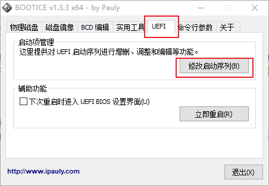
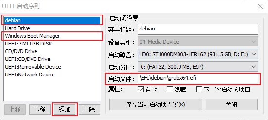

需求: Win+linux 双系统 以及 重装/部署的便携性通用性

痛点:

1. 不喜欢 硬盘上的 windows 恢复工具分区、保留分区 (MSR)
1. 安装 windows 对引导的破坏 bootmgr grub4dos grub2

**解决方案: 改变 windows 的安装方式: 采用 多级差分 vhd/vhdx 安装**

<!-- more -->

## 1. 多级 vhd/vhdx 安装

* Win10.4.Base.0.vhdx: Win10.4 系统的镜像释放 vhdx, 无关硬件, 通用, 到哪都能用
* Win10.4.Base.1.vhdx: 是 Win10.4.Base.0.vhdx 的子盘, Win10.4 系统安装配置完的版本
* Win10.4.vhdx: 是 Win10.4.Base.1.vhdx 的子盘, 日常使用版, 也是引导项中引导的那个

PS: 这种方式几乎没有性能损失

* 安装系统: 只需添加一个引导项即可
* 卸载系统: 只需删除引导项即可
* 重装/还原时

    1. 重建 Win10.4.vhdx: 恢复到刚系统安装配置完的样子
    1. 重建 Win10.4.Base.1.vhdx: 基于 Win10.4 系统全新安装一遍
    1. 重建 Win10.4.Base.0.vhdx: 一般来说不用, 要是想升级版本, 直接 `新建 Win10.5.Base.0.vhdx & 更新引导项`

* 想要一个临时系统: 建 Win10.4.tmp.vhdx 作为 Win10.4.Base.1.vhdx 或 Win10.4.Base.0.vhdx 的子盘, 然后更新引导项 即可

**优点: 便携性、通用性、分区整洁(强迫症)、引导不易被破坏**

## 2. 全新裸机装机

### 2.1 硬盘规划

1. 分区表用 GPT
1. 500G+ 的机械 | 300M ESP | 200G NTFS | 100G / | 100G /home | 10G swap | 其他(D 盘) |
1. 256G 的 SSD | 300M ESP | 150G NTFS | 40G /  | 其他(D 盘) |

### 2.2 装机步骤

1. 进入 UEFI 关闭 Secure boot/安全启动
1. 进入 PE
    1. 将磁盘分区模式改为 GPT/GUID
    1. 新建 ESP 300M
    1. 新建 NTFS 分区 200G=204806M
    1. Win10.4.Base.0.vhdx 放入 NTFS 分区, 创建子盘 Win10.4.vhdx
    1. 更新 引导
1. 安装 debian(刻 U 盘从 U 盘启动/解压到 NTFS 用 setup.exe 安装)

以下为创建上述分区结构的 DiskPart 命令的脚本。将以下代码在 U 盘上保存为文本文件 (CreatePartitions.txt), 在 WinPE 或 win 安装程序分区界面 按 shift+f10, 使用 `DiskPart /s F:\CreatePartitions.txt` 命令, 其中 F 是 U 盘的驱动器号, 用于对驱动器进行分区。

```cmd
select disk 0
clean
convert gpt
create partition efi size=300
format quick fs=fat32 label="System"
assign letter=s
create partition primary size=204806
format quick fs=ntfs label="NTFS"
assign letter=n
```

PS: Windows 安装程序本身就是一个 WinPE, win 安装程序 在 分区界面 按 shift+f10 可以进入 cmd

## 3. 上述的几个技术点详解

### 3.1 制作 VHD Windows 系统

#### 1) 制作 Win10.4.Base.0.vhdx

diskpart
create vdisk file=E:\Win10.4.Base.0.vhdx maximum=102535 type=expandable
attach vdisk
convert gpt
create partition primary
format quick label=Win10
assign letter=z
exit

Dism /apply-image /imagefile:F:\sources\install.wim /index:1 /ApplyDir:z:\

1. E:\Win10.4.Base.0.vhdx 及 F:\sources\install.wim 具体位置适实而定
1. diskpart 的使用
    1. help create vdisk
    1. help create partition
    1. help format
1. 102535: 100G vhdx 102535M MSR 分区为 32 MB。对于大于 16 GB 的磁盘, MSR 分区为 128 MB
1. 使用 dism 释放镜像, 参考
    1. https://msdn.microsoft.com/zh-cn/library/windows/hardware/dn898553(v=vs.85).aspx
    1. https://msdn.microsoft.com/zh-cn/library/windows/hardware/dn898549(v=vs.85).aspx
1. dism 命令中 `1` 的意义: http://www.jianshu.com/p/d486c9c0e399 一定要查看清楚别安错了

#### 2) 创建 子盘

先把母盘 Win10.4.Base.0.vhdx 弹出

diskpart
create vdisk file=E:\Win10.4.vhdx parent=E:\Win10.4.Base.0.vhdx
exit

#### 3) 差分盘合并

diskpart
select vdisk file=E:\Win10.4.vhdx
merge vdisk depth=1                 指出要合并的级数
exit

PS: 为了**减少磁盘占用, 提高磁盘性能**, 我一般会将上文的 Win10.4.Base.1.vhdx Win10.4.Base.0.vhdx 合并为一层, 既

* Win10.4.Base.0.vhdx: Win10.4 系统安装配置完的版本(只是基础配置, 基本没有安装软件)
* Win10.4.vhdx: 是 Win10.4.Base.0.vhdx 的子盘, 安装上软件后就是日常使用版, 也是引导项中引导的那个
* 还有一个 Win10.4.Pure.vhdx: 是 Win10.4.Base.0.vhdx 的子盘, 没有更多配置, 用作 恢复环境(PE)、临时系统、实验环境

### 3.2 引导 vhd/vhdx windows

1. `用 bootmgr 引导 差分 vhd/vhdx Windows`: 应该是引导 vhd/vhdx Windows 最好的方式了
    1. 参考 https://msdn.microsoft.com/zh-cn/library/windows/hardware/dn898496(v=vs.85).aspx
    1. 然而 用 bootmgr 引导 linux 要用 easybcd
1. 使用 grub4dos, 可引导 windows/linux/各种镜像(iso/vhd/...), 但技术略旧
1. `grub2: 可以引导多系统 Linux & bootmgr`

综上考虑, `使用 grub2 作为 主引导, 链式启动 bootmgr 来引导 VHD Windows`

在此还有两个选择

* grub2 引导一个 bootmgr, 然后 bootmgr 引导多个 VHD Windows

    * 使用 bcdboot 添加 VHD/VHDX 系统 的 BCD 信息, 使用此方法添加多个 VHD/VHDX 系统

        ```cmd
        z:\windows\system32\bcdboot z:\windows /s S: /l zh-cn /f UEFI
        ```

        其中: z 为 VHD/VHDX 系统盘 挂载的盘符, S 为 EFI 分区 盘符

        /f 可以加也可以不加, 如果 /f all 是 BIOS 和 UEFI 的启动文件都复制, 不加就是 BIOS, /f uefi 是 UEFI)

        * BCDboot 参考
            * https://technet.microsoft.com/zh-cn/library/dd744347(v=ws.10).aspx
            * https://msdn.microsoft.com/zh-cn/library/windows/hardware/dn898490(v=vs.85).aspx
        * 可以使用 bcdedit 编辑 BCD, 改个语言、启动项名称啥的
        * bootice(一个第三方的 GUI 小程序) 可以查看编辑 BCD 信息, 比较友好
        * Win + R: 运行 msconfig 也可以查看编辑 bootmgr 引导

    * 进入 linux, 更新 grub 即可(只需在第一次向 grub 添加 bootmgr 时更新, 之后修改 bootmgr 不用更新 grub)

* grub2 引导多个 bootmgr, 然后每个 bootmgr 引导一个 VHD Windows

    1. 先说原理

        EFI 分区目录结构如下

            ```sh
            .
            └─EFI
                ├─Boot             引导文件 bootx64.efi 所在
                ├─debian           linux debian 的引导
                └─Microsoft
                   ├─Recovery
                   └─Boot          windows 的引导
                       ├─bg-BG ... 等语言文件
                       ├─Fonts
                       └─Resources
                           ├─en-US
                           └─zh-CN
            ```

        原理: bootmgfw.efi 存放位置任意, bootmgfw.efi 会引导同目录下的 BCD 菜单

        所以, 要想实现 `grub2 引导多个 bootmgr, 然后每个 bootmgr 引导一个 VHD Windows`, 只需有多个存放了 bootmgfw.efi 的文件夹即可, 例如

            ```sh
            .
            └─EFI
                ├─Boot             引导文件 bootx64.efi 所在
                ├─debian           linux debian 的引导
                └─Microsoft
                   ├─Recovery
                   ├─Boot          第一个 windows 的引导, 存放了 bootmgfw.efi
                   └─Boot1         第二个 windows 的引导, 存放了 bootmgfw.efi
            ```

    1. 具体过程:

        1. 使用 bcdboot 添加 VHD/VHDX 系统 的 BCD 信息

            ```cmd
            z:\windows\system32\bcdboot z:\windows /s S: /l zh-cn /f UEFI
            ```

            其中: z 为 VHD/VHDX 系统盘 挂载的盘符, S 为 EFI 分区 盘符

        1. 重命令 \EFI\Microsoft\Boot 为 \EFI\Microsoft\Boot1
        1. 用第一步的方法继续添加 其余 windows 的 BCD 信息
        1. 都添加完了, 进入 linux, 修改 grub 配置: 编辑 /etc/grub.d/40_custom 然后 `grub-mkconfig -o /boot/grub/grub.cfg` (update-grub/update-grub2(Debian Ubuntu)其实就是执行的这条命令)

            参考 https://wiki.archlinux.org/index.php/GRUB_(%E7%AE%80%E4%BD%93%E4%B8%AD%E6%96%87)#UEFI-GPT_.E6.A8.A1.E5.BC.8F.E4.B8.8B.E5.AE.89.E8.A3.85.E7.9A.84Windows.E7.9A.84.E5.90.AF.E5.8A.A8.E9.A1.B9

            UEFI-GPT 模式下安装的 Windows 的启动项

            ```sh
            menuentry "Windows 2th" {
                insmod part_gpt
                insmod fat
                insmod search_fs_uuid
                insmod chain
                search --fs-uuid --set=root $hints_string $fs_uuid
                chainloader /EFI/Microsoft/Boot1/bootmgfw.efi
            }
            ```

            $hints_string 和 $uuid可以通过以下命令获取。

            $uuid:

            ```sh
            # grub-probe --target=fs_uuid /boot/efi/EFI/Microsoft/Boot/bootmgfw.efi
            1ce5-7f28
            ```

            $hints_string:

            ```sh
            # grub-probe --target=hints_string /boot/efi/EFI/Microsoft/Boot/bootmgfw.efi
            --hint-bios=hd0,gpt1 --hint-efi=hd0,gpt1 --hint-baremetal=ahci0,gpt1
            ```

            还可以添加 "Shutdown" "Restart" 启动项

            ```sh
            # "Shutdown" 启动项
            menuentry "System shutdown" {
                echo "System shutting down..."
                halt
            }
            # "Restart" 启动项
            menuentry "System restart" {
                echo "System rebooting..."
                reboot
            }
            ```

我选第二种方法, 比较整洁, 看见来就像只有一个引导(当 bootmgr 只引导一个 windows 时不会出现 bootmgr 的界面)。而且修改时改 grub 比较简单。

关于 GRUB2 的扩展阅读

* https://wiki.archlinux.org/index.php/GRUB_(%E7%AE%80%E4%BD%93%E4%B8%AD%E6%96%87)
* https://wizardforcel.gitbooks.io/vbird-linux-basic-4e/content/168.html
* http://www.cnblogs.com/f-ck-need-u/p/7094693.html

## 4. 开机直接进了 Windows 的解决办法

经常见的是: 啥也没做, 忽然开机就直接进入 Windows 了, 越过了 GRUB

经过我数十次的重装后, 终于找到原因了/笑哭。之前一直在搞引导, 但并不是开机直接进入引导的! 开机先进入 BIOS/UEFI, BIOS/UEFI 根据它的 `启动序列` 进行启动。双系统安装(先 Win 后 Linux)完成后, GRUB 成为了 `UEFI启动序列` 第一个, 所以实现了用 GRUB 引导 双系统。

而常说的 Windows 对引导的破坏主要有以下两种情况

* Windows 全新安装会直接删除 GRUB 的 UEFI 启动项(EFI 分区的 grubx64.efi 还在, 但 UEFI 启动项没了)
* Windows 进行了更新(一般是大版本更新), 然后将 `Windows Boot Manager` UEFI 启动项放到了 `UEFI启动序列` 第一个, 所以就越过了 GRUB

解决方案就是修改 UEFI 启动项

* Win 系统(PE 也可以) + BOOTICE: 最简单的方法了, 看下面两张截图就懂了
* UEFI Shell





不管是 `Windows Boot Manager` UEFI 启动项跑到了 GRUB 的前面, 还是 GRUB UEFI 启动项没了, 都可以轻松解决。

扩展阅读: https://blog.woodelf.org/2014/05/28/uefi-boot-how-it-works.html

## 最后, 需要注意的小点

* 要想 VHD 的差分链不断, 一定不要移动 VHD 位置
* 注意: 双系统中 Linux 常常不能正常挂载 NTFS 分区, 因为 Win8 以来的 `快速启动` 为加快开关机的速度, 关机时没有正常卸载磁盘, 所以强烈建议关闭 Windows 的快速启动。若是 VHD 系统, 因为 VHD 的 windows 天然不能开启快速启动, 省下了设置。
